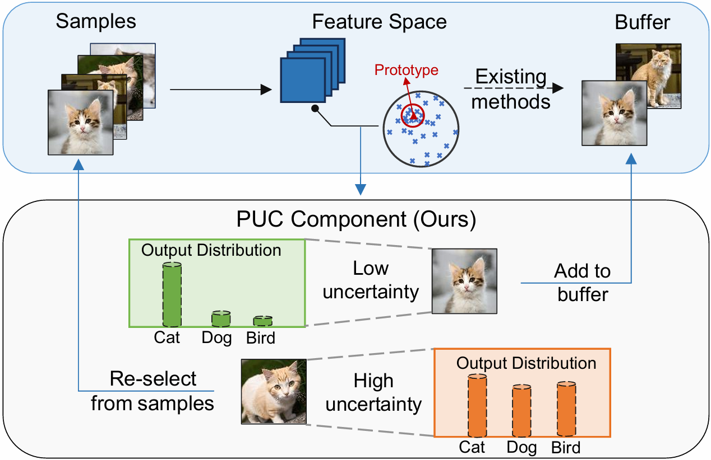

<div align="center">
<h1> Enhancing Replay-Based Continual Learning via Predictive Uncertainty Controller
</h1>
<div>
    <a>Chunhui Ding</a>&emsp;
    <a target='_blank'>Aojun Lu</a>&emsp;
    <a target='_blank'>Jiahao Fan</a>&emsp;
    <a href='https://yn-sun.github.io/' target='_blank'>Yanan Sun&#9993</a>&emsp;
</div>

</div>



> Abstract:
> Continual Learning (CL) aims to develop AI models that learn effectively from sequential tasks while mitigating catastrophic forgetting. Replay-based methods have emerged as a promising solution for CL, which stores a subset of past exemplars and then replays it to preserve prior knowledge. Existing exemplar selection strategies predominantly focus on feature-space representativeness but overlook output distribution variation. In this work, we identify that neighboring samples in feature space may sustain significantly different output probability distributions. This indicates that the nearest neighbors to class-wise mean feature vectors do not consistently serve as optimal representative samples. We further demonstrate that predictive uncertainty serves as a reliable indicator of such non-representative samples. Building on this insight, we propose Predictive Uncertainty Controller (PUC), which aims to benefit replay-based CL methods by filtering out samples with excessive uncertainty. Extensive experiments validate our approach, showing that PUC consistently enhances CL performance when integrated with existing replay-based methods. 

## Information before using this repo
In order to run the code, you will need to configure the paths to match your own system (see ./utils/data.py).

If there are any questions, please feel free to open an issue or contact with the author: **Chunhui Ding** ([chunhuiding9@gmail.com](mailto:aojunlu@stu.scu.edu.cn))

⭐⭐⭐Consider starring the repo! ⭐⭐⭐

## How to Use
1. Edit the `[MODEL NAME].json` file for global settings.
2. Edit the hyperparameters in the corresponding `[MODEL NAME].py` file (e.g., `models/finetune.py`), where hyperparameters `alpha`and `beta` determine the threshold settings.
3. Run:

```bash
python main.py --config=./exps/[MODEL NAME].json
```

where [MODEL NAME] includes `finetune`,`replay`,`icarl`,`wa` and `foster`.


## Acknowledgement
Part of this work's implementation refers to [PyCIL](https://github.com/G-U-N/PyCIL).
